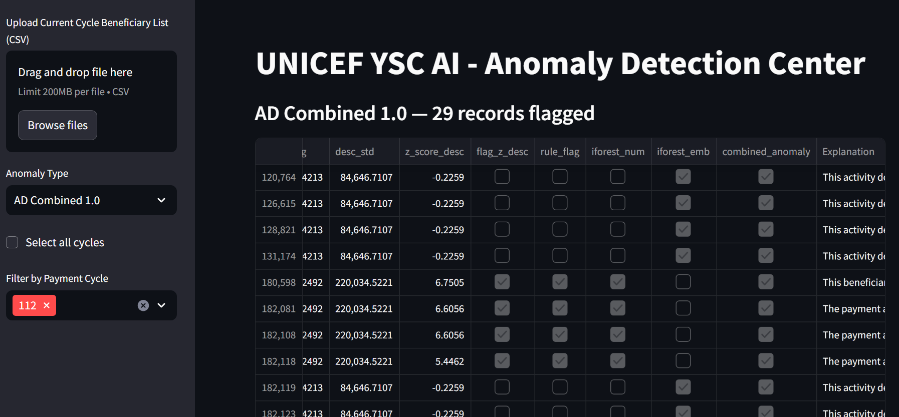
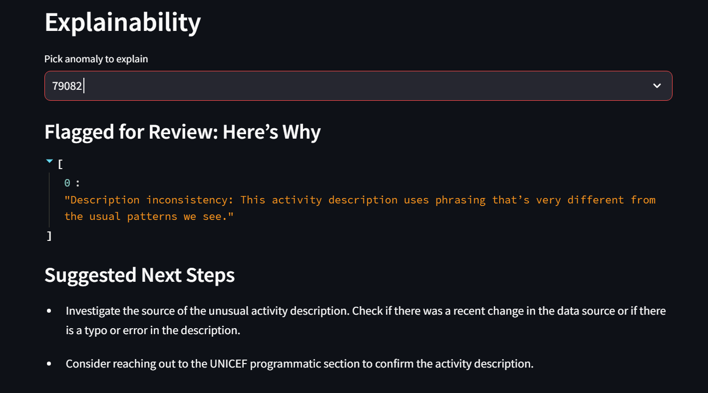

# AI Anomaly Detection for Cash Transfers

A proof-of-concept web dashboard and modular Python package to detect various types of anomalies in beneficiary payment data and reconciliation records, designed for large-scale cash-transfer programs.

### 📁Repository Layout

```
anomaly_dashboard/
├── modules/                  	# Individual anomaly‐detection scripts
│   ├── amount_spike.py       	# Detects abrupt spikes in payment amounts
│   ├── freq_surge.py         	# Flags beneficiaries with sudden payment‐frequency jumps
│   ├── district_surge.py     	# Identifies district/site‐level surges in total disbursements
│   ├── cycle_irregularity.py 	# Finds irregularities in per‐cycle totals and counts
│   ├── id_integrity.py       	# Checks consistency of beneficiary IDs, names, and phones
│   └── desc_inconsistency.py 	# Detects anomalous or mislabeled payment descriptions
├── app.py                     	# Web UI dashboard that ties together all modules
├── requirements.txt           	# Python package dependencies and versions
├── .gitignore                 	
└── README.md
├── docs/
│   └── Explainable_Deep_Learning_Anomaly_Detection.docx
├── CONTRIBUTING.md
└── SECURITY.md
```


##  Features

- **Six Anomaly Types**  
  1. Abrupt Payment Amount Spike  
  2. Payment Frequency Surge (Cycle-to-Cycle)  
  3. District/Payment Site Surge  
  4. Beneficiary ID Integrity Issues  
  5. Payment Cycle Irregularity  
  6. Inconsistent Payment Description   


###  Multi-Method Anomaly Detection Framework

The framework combines multiple, complementary estimation methods, each with clear, human-readable decision criteria to catch a wide range of anomalies while preserving full transparency:

#### 🔹 Rule-Based Guards
- Hard thresholds (e.g., “payment > 3 × individual historical average”, “> 3 payments per cycle”) that immediately flag deviations.  

#### 🔹 Dynamic Z-Score Analysis
- Point and contextual outliers are identified when a value falls outside the beneficiary or cluster-level mean ± 3 σ, with those exact numbers surfaced alongside each alert.

#### 🔹 Isolation Forest
- An unsupervised tree-ensemble assigns every record an anomaly score, where a shorter average path indicates a more anomalous record.

#### 🔹 Collective Outlier Detection & SPC
- We monitor aggregated sums and counts per district or cycle via control-chart bounds and collective-outlier techniques to catch region- or cycle-wide irregularities  

#### 🔹 Cluster & Spatio-Temporal Analysis
- KMeans or HDBSCAN groups beneficiaries (or descriptions) by behavior, and geographic/time comparisons highlight when an entire group diverges unexpectedly.

#### 🔹 Fuzzy-Matching Consistency Checks
- For identity integrity, we apply normalized-string and exact-match checks on names, ID numbers, and phone numbers with the rapid fuzzy ratio or unique function.

#### 🔹 Semantic Embedding & Clustering
- Arabic payment descriptions are embedded via a multilingual transformer and clustered; we then compute cluster mean/std on amounts and flag any description whose z-score or embedding outlier status exceeds the threshold.

---

## Installation

1. **Clone the repo**  
   ```bash
   git clone https://github.com/UNICEF-Ventures/Anomaly-Detection-of-Cash-Transfer.git anomaly_dashboard
   cd anomaly_dashboard

2. Create & activate a conda env

   ```bash
   conda create -n anomaly_dashboard python=3.9
   conda activate anomaly_dashboard
   ```

3. Install dependencies

   ```bash
   pip install --upgrade pip
   pip install -r requirements.txt
   ```


## Usage

```bash
Run the Streamlit app:
streamlit run app.py --server.port 8501
```


## Dashboard Sections:

1. Anomaly Type Selection

2. Cycle Filter (latest by default, “Select all” option)

3. Optional CSV Upload (overrides ADLS for current cycle)

4. Results Table + Download XLSX







## Additional Documentation
 
The uploaded modular scripts in this repository focus on rule-based, statistical, and ML-based anomaly detection methods.  
They do **not** include deep learning implementations by default.  

However, we prepared a separate document on **Explainable Deep Learning Models for Anomaly Detection**.  
This 19-page **technical manuscript (including formal equations and tabular analyses)** serves as an optional resource for contributors or researchers who wish to experiment with deep learning approaches.

- [Explainable Deep Learning Models for Anomaly Detection - PDF version](docs/Explainable_Deep_Learning_models_Anomaly_Detection.pdf)


